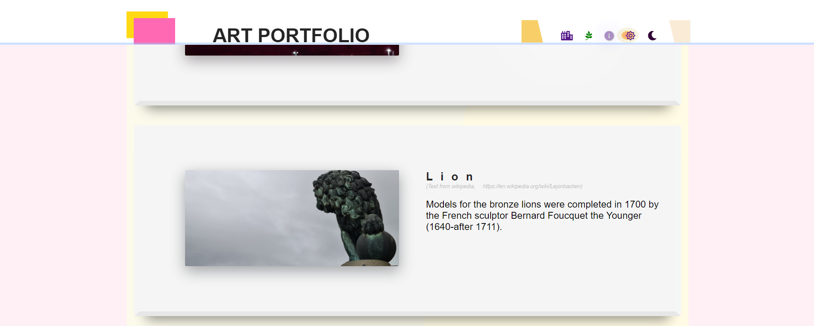

# Art portfolio

###### This website is for hobby photoagrapher to be inspired and contains pitchers of urban environment and nature. Every photo is taken by me and most of them is from Stockholm. 

# Navigations
click the font awesome icons to look at pitchers from:
* Urban
* Nature 

At the bottom of the page "_the footer_" you will find two links, one to my linked in and the other to form. Both 
opens i a new window. 

~~ unfixed code or bugs ~~
1. Dark-mode has a unfinished footer
2. Dark mode is lacking media query and is only suitable for normal sizes screen.
3. Dark modes dim moonlight created from pinkbox should be to the right of the moon. 
4. Info about me is lacking.
5. Info in dark mode has the divs in colums instead of rows.
6. The form will go to a codeinstitute dump. 

This is **my first website** and everything is created by me, of course with the help of codeinstitute and goolge.
The box shadow is inspired of __getcssscan.com__ and some colors are from __flatuicolors.com__. I dont se this as plagiarism.
The webkit-animation on line __176__ in the style.css is on the edge of plagiarism becouse I dont fully comprehend it. But it do look so good with.

# Navigations
* click the font awesome icons to look at urban or nature pitchers.
* dark mode is working but has a lot of unfixed code
-in the footer you wwill find a lik to a form and my linkedin page.
-enjoy

css code is validate. 

